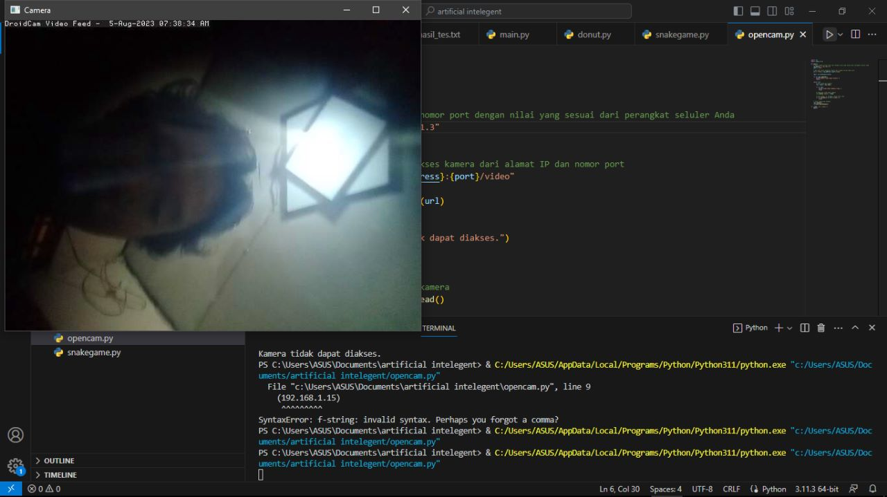

# DroidCam - Aplikasi Webcam untuk Perangkat Seluler Android

DroidCam adalah aplikasi webcam yang memungkinkan Anda menggunakan kamera ponsel Android sebagai webcam nirkabel untuk komputer Anda. Aplikasi ini berguna untuk panggilan video, konferensi online, streaming, dan berbagai keperluan lainnya yang memerlukan webcam.

## Fitur Utama

- Mengubah kamera ponsel Android menjadi webcam nirkabel.
- Dukungan untuk kamera depan dan kamera belakang ponsel.
- Kualitas video yang dapat disesuaikan.
- Dukungan untuk berbagai aplikasi panggilan video dan konferensi online.
- Bebas iklan dan sederhana digunakan.

## Cara Penggunaan

1. Pastikan ponsel Anda dan komputer berada dalam jaringan Wi-Fi yang sama.
2. Unduh dan instal aplikasi DroidCam di ponsel Android Anda dari [Google Play Store](https://play.google.com/store/apps/details?id=com.dev47apps.droidcam).
3. Unduh dan instal aplikasi DroidCam untuk komputer Anda dari [droidcam.com](https://www.dev47apps.com/droidcam/windows/).
4. Buka aplikasi DroidCam di ponsel Anda dan catat alamat IP yang ditampilkan.
5. Jalankan aplikasi DroidCam di komputer Anda dan masukkan alamat IP yang telah dicatat.
6. Klik tombol "Start" di aplikasi DroidCam di komputer Anda untuk mulai menggunakan kamera ponsel sebagai webcam.

## Kontribusi

Kontribusi terbuka! Jika Anda menemukan masalah atau ingin berkontribusi pada proyek ini, silakan buat _issue_ atau _pull request_ melalui repositori GitHub ini.

## Lisensi

DroidCam merupakan perangkat lunak berlisensi MIT. Lihat file [LICENSE](LICENSE) untuk detail lisensi.

## Kontak

Jika Anda memiliki pertanyaan atau masalah terkait DroidCam, silakan hubungi kami di email: support@droidcam.com atau kunjungi situs web kami di [www.droidcam.com](https://www.droidcam.com/).

